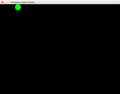
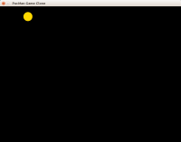
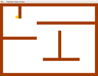
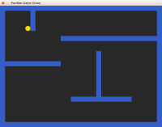
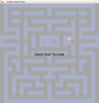
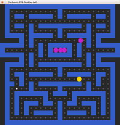
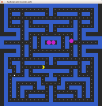
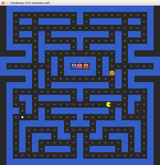

# Клон игры PacMan на SFML по шагам

В этих примерах описано создание клона игры шаг за шагом. Код написан на C++ в процедурном стиле для максимально лёгкого чтения. Для сборки примеров потребуется CMake, C++ компилятор (G++, Clang или MSVC) и библиотека SFML.

## Слой №1: неподвижный шарик

<a href="pacman_1">В 1-м примере</a> в программе будет заложен основной цикл игры.

## Слой №2: управление персонажем

<a href="pacman_2">Во 2-м примере</a> добавлено управление персонажем с помощью клавиш-стрелок.

## Слой 3: стены и проходы лабиринта

<a href="pacman_3">В 3-м примере</a> добавлены стены и проходы лабиринта, но пока ещё нет обработки столкновений

## Слой 4: обработка столкновений

<a href="pacman_4">4-q пример</a> покажет, как реализовать базовую обработку столкновений (англ. collisions) со стенами лабиринта

## Слой 5: призраки и поражение

<a href="pacman_5">В 5-м примере</a> появится возможность проиграть в случае, если PacMan столкнётся с призраком.

## Слой 6: печенье и победа

<a href="pacman_6">В 6-м примере</a> мы добавим печенье, которое пакман должен поедать, и реализуем возможность победы.

## Слой 7: улучшаем пакмана

<a href="pacman_7">В 7-м примере</a> появятся графические улучшения: мы добавим пакману ракрывающийся рот и правдоподобную анимацию движения.

## Слой 8: улучшаем призраков

<a href="pacman_8">В 8-м примере</a> мы увидим врага в лицо: каждому призраку будет обеспечено собственное изображение, с анимацией, указывающей направление движения.

