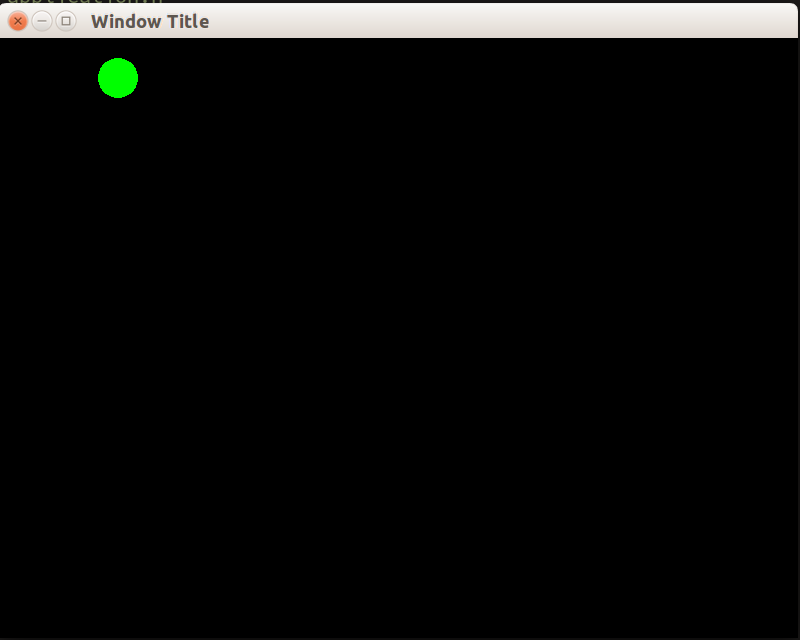

# Подключение SFML к Visual Studio

Эта статья покажет, как настроить и запустить простую программу на SFML:



### Выбор Visual Studio

### Загрузка SFML

Актуальную версию можно найти на [www.sfml-dev.org](http://www.sfml-dev.org/download.php). Выбирайте 32-х или 64-хбитную библиотеку для нужной версии Visual Studio.


### Новый C++ проект

Для создания проекта в Visual Studio нужно выбрать один из шаблонов, указать имя и путь к директории проекта. Для наших целей подходят шаблоны "Console Application" и "Empty Project". После создания следует

- перейти к файлу, название которого совпадает с именем проекта &mdash; там была размещена функция `main()`
- добавить включение заголовочного файла ```SFML/Graphics.hpp```
```cpp
#include <SFML/Graphics.hpp>
```
- нарисовать круг с помощью библиотеки SFML

В рамках первого урока листинг можно скопировать прямо в функцию main().

##### Код рисования круга
```cpp
sf::RenderWindow window(sf::VideoMode(800, 600), "Window Title");
sf::CircleShape shape;
shape.setRadius(20);
shape.setFillColor(sf::Color::Green);
shape.setPosition(100, 0);

while (window.isOpen())
{
    sf::Event event;
    while (window.pollEvent(event))
    {
        if (event.type == sf::Event::Closed)
        {
            window.close();
        }
    }
    window.clear();
    window.draw(shape);
    window.display();
}
```

### Запускаем код

TODO:

- добавляем путь к include (через локальные настройки)
- добавляем путь к lib
- добавляем отладочные библиотеки
- добавляем макрос SFML_DYNAMIC
- добавляем команду copy в PostBuild шаг сборки

### Исследуем код

В листинге мы сделали несколько вещей:

- создали объект класса `sf::RenderWindow`, абстрагирующий работу с окном
- создали и настроили объект класса `sf::CircleShape`, абстрагирующий работу с фигурой &mdash; кругом
- запустили основной цикл приложения

Основной цикл пока что очень прост:

1. перед рисованием кадра происходит опрос внешних событий. Если события есть, то метод `window.pollEvent` вернёт булево значение `true` и скопирует информацию о событии в 1-й аргумент.

```cpp
sf::Event event;
while (window.pollEvent(event))
{
    if (event.type == sf::Event::Closed)
    {
        window.close();
    }
}
```

2. после опроса событий окно очищается (заливается чёрным цветом), затем на нём рисуется фигура, затем очередной кадр отправляется операционной системе, которая отобразит кадр окна на экране

```cpp
window.clear();
window.draw(shape);
window.display();
```

### Система коодинат SFML

Отсчёт координат в SFML, как и в большинстве графических библиотек, начинается с левого верхнего угла.

- мы установили (100,20) как двумерную координату круга
- радиус круга сделали равным 20
- однако, центр круга расположен в точке (120,40), потому что метод `shape.setPosition` изменил положение левого верхнего угла фигуры.


### Далее

- [второй урок](2.md)
- [гайд по работе с окном (sfml-dev.org)](http://www.sfml-dev.org/tutorials/2.3/window-window.php)
- [подробный гайд по настройке SFML для Visual Studio (sfml-dev.org)](http://www.sfml-dev.org/tutorials/2.3/start-vc.php)