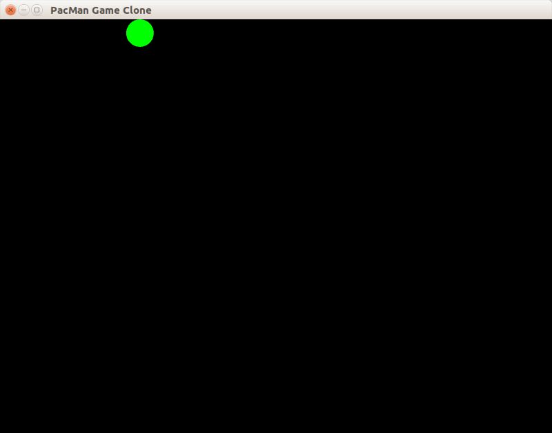

# Слой 1: основной цикл игры

Этот слой содержит:

 1. создание окна и вывод фигуры на экран
 2. основной цикл игры



## Основной цикл игры

[Основной цикл игры](https://martalex.gitbooks.io/gameprogrammingpatterns/content/chapter-3/3.2-game-loop.html) — это шаблон проектирования кода, который применяется практически в каждой игре. Он диктует, как должна выглядеть основная процедура игры (`main` в языках C/C++): сначала происходит инициализация, а затем начинается цикл, выход из которого происходит непосредственно перед закрытием приложения. Общая схема игрового цикла:


Основной цикл пока что очень прост:

 - перед рисованием кадра происходит опрос внешних событий. Если события есть, то метод `window.pollEvent` вернёт булево значение `true` и скопирует информацию о событии в 1-й аргумент.

```cpp
sf::Event event;
while (window.pollEvent(event))
{
    if (event.type == sf::Event::Closed)
    {
        window.close();
    }
}
```

 - игрового состояния в данный момент нет, поэтому обновлять нечего

 - после опроса событий окно очищается (заливается чёрным цветом), затем на нём рисуется фигура, затем очередной кадр отправляется операционной системе, которая отобразит кадр окна на экране

```cpp
window.clear();
window.draw(shape);
// метод display отдаёт кадр операционной системе, а также может ожидать
// сигнала вертикальной синхронизации монитора (vsync).
window.display();
```

Современные операционные системы обычно обновляют экран с частотой 60Гц, и такой же частоты ожидают от приложений. Поэтому на выполнение одной итерации цикла отведено `1.0 / 60.0 = 0.016(6)` секунд, то есть чуть более 16 миллисекунд. Естественно, все современные игры стремятся уложиться в этот интервал независимо от сложности моделируемого игрового мира.
