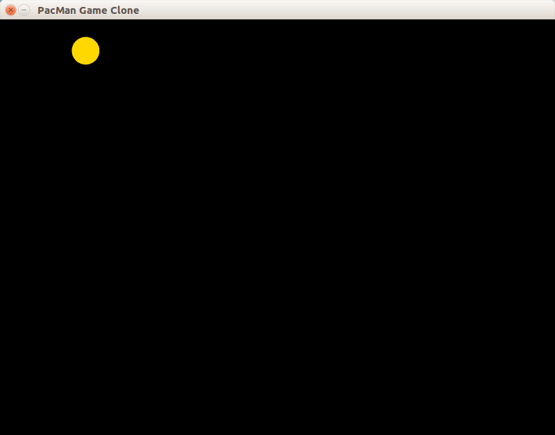

# Слой 2: управление персонажем

Этот слой содержит:

 1. обработку ввода - нажатий на клавиши-стрелки
 2. перемещение персонажа в выбранном направлении
 3. проект игры разделён на два разных cpp-файла, один из которых будет содержать основной цикл игры, а другой - функции и константы, относящиеся к пакману



## Обработка событий клавиатуры

Данные о событии нажатия или освобождения клавиши хранит структура [sf::Event::KeyEvent](https://www.sfml-dev.org/documentation/latest/structsf_1_1Event_1_1KeyEvent.php), доступная в поле `.key` структуры `sf::Event`.

Типичный путь обработки событий клавиш - это switch по кодам клавиш. Подробнее читайте на сайте SFML в руководстве [Events explained](https://www.sfml-dev.org/tutorials/2.4/window-events.php).

Также вы можете прочитать руководство [Keyboard, mouse and joystick (sfml-dev.org)](http://www.sfml-dev.org/tutorials/2.4/window-inputs.php)

## Представим направление движения с помощью перечислений (enum)

На данный момент пакман представлен единственным объектом типа [sf::CircleShape](www.sfml-dev.org/documentation/latest/classsf_1_1CircleShape.php). Теперь нам потребуется ещё и хранить направление движения пакмана.

Можно было бы кодировать направление движения в виде целого числа, и считать, что 0 означает отсутствие движения, 1 — движение влево, 2 — движение вправо, и так далее. Но такие обозначения вносят путаницу, о них легко забыть, а с ростом количества кода они вообще перестают нормально восприниматься.

К счастью, в языке C есть перечислимые типы данных. Существуют они в двух вариантах: более древний простой `enum`-тип и новый, более строгий `enum struct` (он же `enum class`):

```cpp
// Старый синтаксис языка C, легко порождает конфликты с другими константами.
// добавляет во внешнюю область видимости константы NONE == 0,
// UP == 1, DOWN == 2 и так далее.
// константа NONE - слишком часто употребляемое имя.
enum Direction
{
    NONE,
    UP,
    DOWN,
    LEFT,
    RIGHT
};

// Новый синтаксис C++ 2011, позволяет избегать конфликтов
// добавляет во внешнюю область видимости константы Direction::NONE == 0,
// Direction::UP == 1 и так далее. Имя Direction::NONE ни с чем не конфликтует.
enum struct Direction
{
    NONE,
    UP,
    DOWN,
    LEFT,
    RIGHT
};
```

Мы, конечно же, применим более строгий перечислимый тип `enum struct Direction`, как указано в втором варианте объявления Direction. Добавьте в проект новый файл `pacman.h` и перенесите в него объявление `enum struct Direction`.

## Замена нескольких параметров на структуру (struct)

Мы не будем использовать глобальные переменные. Код, содержащий глобальные переменные, с ростом размера становится чрезмерно запутанным: невозможно анализировать и развивать код отдельной функции, не держа в голове все глобальные переменные и все остальные функции, влияющие на них.

Всё необходимое для работы функции можно передать через параметры. Например, функция для рисования пакмана была объявлена так:

```cpp
void render(sf::RenderWindow & window, sf::CircleShape & shape)
{
    window.clear();
    window.draw(shape);
    window.display();
}
```

Но если отказаться от глобальных переменных, со временем могут возникнуть новые проблемы:

- код функции разрастается и становится неудобным для чтения
- число параметров функции возрастает
- возникает необходимость как-то возвращать из функции несколько значений

Первая проблема решается путём дальнейшего деления на вспомогательные функции. Остальные две проблемы можно решить с помощью составных типов данных, например, структур `struct` или контейнеров стандартной библиотеки C++. Синтаксис определения пользовательской структуры:

```cpp
// синтаксис (упрощённый)
struct Идентификатор
{
    Тип_поля_№1 имя_поля_№1;
    Тип_поля_№2 имя_поля_№2;
    // и так далее ...
};
// пример
struct Pacman
{
    sf::CircleShape shape;
    Direction direction;
};
```

Обращение к полям структуры можно выполнить с помощью оператора ".":

```cpp
void initializePacman(Pacman &pacman)
{
    pacman.direction = Direction::NONE;
    pacman.shape.setRadius(20);
    pacman.shape.setFillColor(sf::Color::Green);
    pacman.shape.setPosition(100, 0);
}

// старое длинное определение без структур:
void initializePacman(sf::CircleShape & shape, Direction & direction)
{
    // ...
}
```
